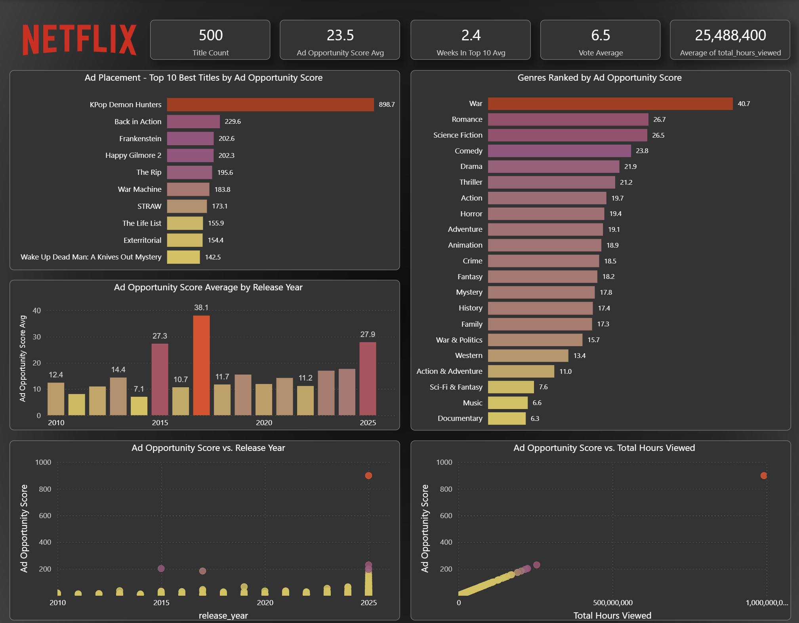
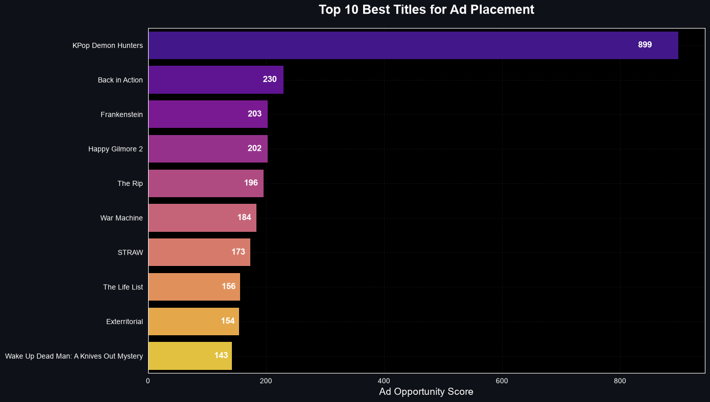
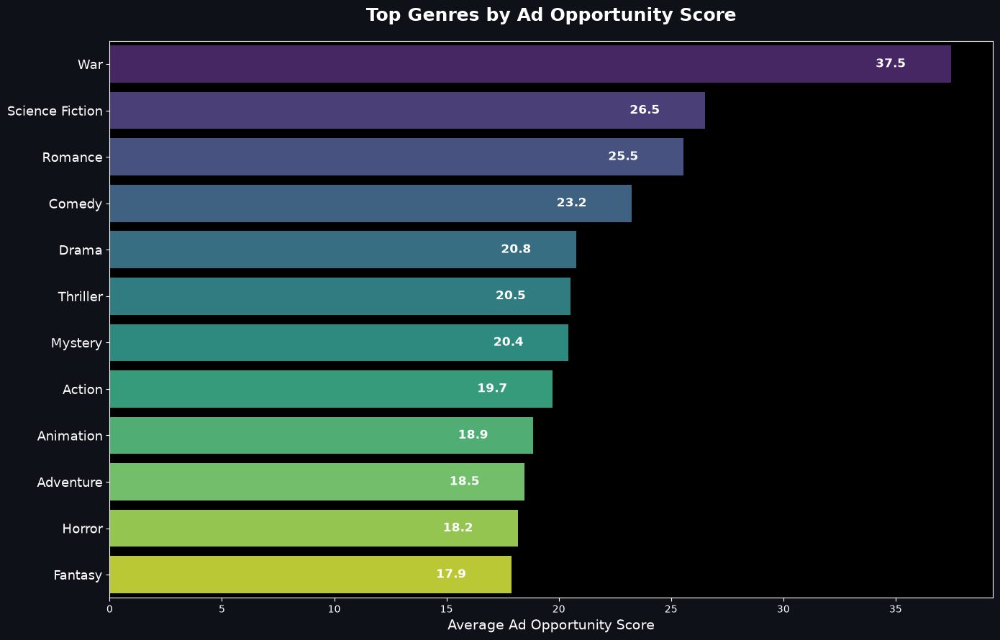

# Netflix Ads Analytics Portfolio Project

 

**End-to-End Analytics Engineering Project** simulating ad platform insights for Netflix's Ads Data Science & Engineering team.

## Business Objective
Build metrics, deep-dive analysis, and self-service tools to support decision-making in Netflix's ad-supported tier (0-1 space).

## What I Built
- Ingested and cleaned large Netflix content + 2025-2026 viewership datasets
- Created custom **Ad Opportunity Score** combining duration, recency, ratings, and actual hours viewed
- Merged metadata with real top-viewed titles
- Generated insights on best content for ad placement
- Prepared data for interactive Power BI dashboards

## Power BI Dashboard
Interactive Power BI report available in the `Reports` folder:
- **File:** [Reports/Netflix Ads Analytics.pbix](Reports/Netflix%20Ads%20Analytics.pbix)

## Data Sources
See [data_download.md](data_download.md) for download links and setup instructions.

## Tech Stack
- **Python** (Pandas, Matplotlib, Seaborn) – ETL & Analysis
- **Jupyter Notebooks** – Exploration
- **Git + GitHub** – Version control
- **Power BI** / Microsoft Fabric

## Ad Opportunity Score Logic
Rank  Component             Relative Weight     Business Rationale
1     Total Hours Viewed    ~70–80%             Strongest predictor of ad inventory value
2     Weeks in Top 10       ~10–15%             Measures sustained cultural relevance
3     Vote Average          ~5–8%               Higher-rated titles hold attention longer
4     Release Year          ~2–5%               Newer content attracts more viewers

## Key Insights
- Analyzed **32,000+ Netflix titles** (up to 2025) combined with **2025–2026 Top 500 global viewership data**
- Created custom **Ad Opportunity Score** prioritizing actual hours viewed, duration, recency, and trending performance
- **Top Titles**: KPop Demon Hunters (#1 with massive viewership), Back in Action, Frankenstein, etc.
- **Top Genres**: War, Science Fiction, Romance, and Action-heavy content show strongest ad potential

## How to Run
1. `git clone` this repo
2. `python -m venv venv && venv\Scripts\activate`
3. `pip install -r requirements.txt`
4. Open `notebooks/01_data_exploration.ipynb`

